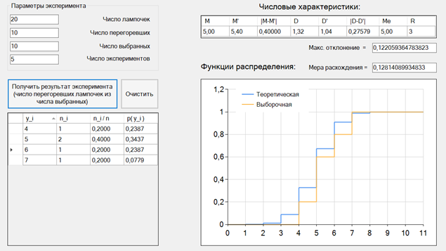
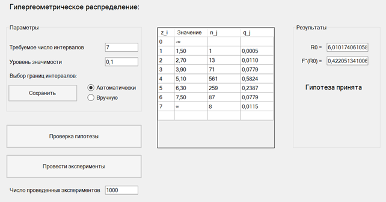

# Моделирование случайной величины

С++, Visual Studio

-------------

## Описание эксперимента

В партии из `N` лампочек `M` перегоревших. Случайная величина `η` - число перегоревших лампочек среди `R` выбранных наудачу.

Случайная величина `η` имеет гипергеометрическое распределение.

## Задание

1. Моделирование случайное величины: написать первую часть программы – «розыгрыш» значений случайной величины. Пользователь с клавиатуры вводит количество повторений экспериментов и параметры задачи.
2. Изучение статистических характеристик случайной величины: определить теоретические и выборочные числовые характеристики случайной величины (теоретические и выборочные математическое ожидание и дисперсия, выборочная медиана, размах выборки). Построить графики теоретической и выборочной функций распределения. Вычислить меру их расхождения.
расхождения.
3. Проверка гипотезы о виде распределения: сформулировать проверяемую гипотезу, реализовать критерий `χ2` для проверки гипотезы, обосновать решение о принятии/отвержении гипотезы.

## Скриншоты

